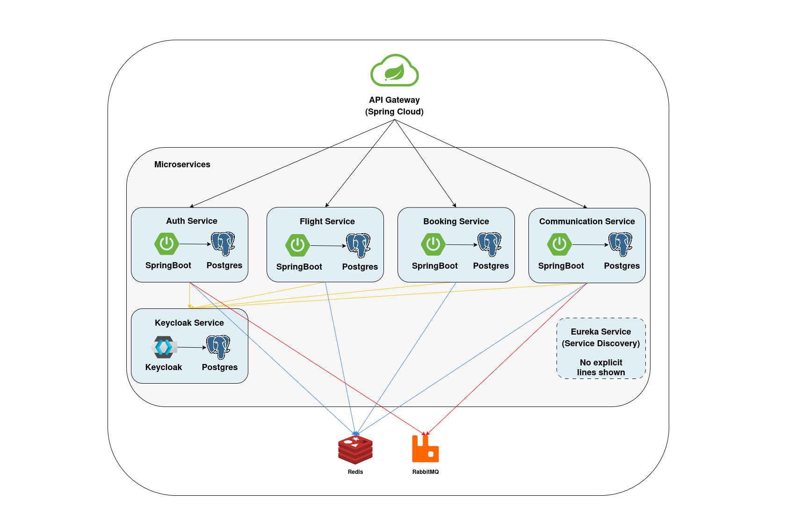

# Booking App - Microservices Architecture

## Table of Contents

- [Overview](#overview)
- [Architecture](#architecture)
- [Technologies](#technologies)
- [Key Features](#key-features)
  - [Authentication & User Management](#authentication--user-management)
  - [Flight Search](#flight-search)
  - [Booking & Payment](#booking--payment)
  - [Reliable Messaging (Inbox-Outbox Pattern)](#reliable-messaging-inbox-outbox-pattern)
  - [Observability](#observability)
- [Technology Stack](#technology-stack)
- [System Design Chart](#system-design-chart)
- [Development Process](#development-process)
- [Quick Start](#quick-start)
  - [Prerequisites](#prerequisites)
  - [Run with Docker Compose](#run-with-docker-compose)
  - [Configuration](#configuration)
  - [Development Profiles](#development-profiles)
- [API Documentation](#api-documentation)
- [Testing](#testing)
- [Contributing](#contributing)
  - [Branch Strategy](#branch-strategy)
  - [Commit Convention](#commit-convention)
  - [Code Quality](#code-quality)
- [License](#license)

---

## Overview

A production-ready flight booking platform built with a microservices architecture. The system provides end-to-end flight search, booking, payment processing, and user management capabilities with a focus on reliability, scalability, and maintainability.

---

## Architecture

The system comprises the following microservices:

- **API Gateway** - Edge server routing requests with validation (tracing, locale, idempotency)
- **Eureka Service Discovery** - Service registration and discovery
- **Auth Service** - User authentication, registration, and session management
- **Flight Service** - Flight search, availability, and seat management
- **Booking Service** - Booking creation, payment processing, and order management
- **Communication Service** - Email and SMS delivery via SendGrid/Twilio

---

## Technologies
- Using `Microservices Architecture` for `architecture` level.
- Using `Spring MVC` as a `Web Framework`.
- Using `Spring AMQP` on top of `Rabbitmq` for `Event Driven Architecture` between our microservices.
- Using `gRPC` for `internal communication` between our microservices.
- Using `Spring Data JPA` for `data persistence` and `ORM` in `write side` with `Postgres`.
- Using `Inbox Pattern` for ensuring message idempotency for receiver and `Exactly once Delivery`.
- Using `Outbox Pattern` for ensuring no message is lost and there is at `At Least One Delivery`.
- Using `Unit Testing` for testing small units and mocking our dependencies with `Mockito`.
- Using `End-To-End Testing` and `Integration Testing` for testing `features` with all dependencies.
- Using `Spring Validator` and a `Validation Pipeline Behaviour` on top of `Mediator`.
- Using `Keycloak` for `authentication` and `authorization` base on `OpenID-Connect` and `OAuth2`.
- Using `Spring Cloud Gateway` as a microservices `gateway`.

---

## Key Features

### Authentication & User Management
- Email/phone registration with verification
- Google OAuth2 integration
- JWT token management with refresh tokens
- Password reset and change functionality
- Account lockout after failed attempts
- Role-based access control (USER, ADMIN)

### Flight Search
- One-way and round-trip searches
- Flexible filters: price, airline, cabin class, aircraft type
- Redis-based caching for popular routes
- Parallel async search execution with timeout handling
- Pagination and sorting support

### Booking & Payment
- Seat reservation with hold period (15 minutes)
- Atomic seat availability checks
- Idempotent payment processing
- Multiple locking strategies (PESSIMISTIC, OPTIMISTIC, DISTRIBUTED)
- Booking reference (PNR) generation
- Payment amount validation

### Reliable Messaging (Inbox-Outbox Pattern)
- Transactional outbox for reliable event publishing
- Idempotent inbox processing with duplicate detection
- Automatic retry and dead-letter handling
- DLQ monitoring and admin replay endpoints

### Observability
- Distributed tracing (Correlation, Request, Transaction IDs)
- MDC logging context propagation
- Resilience4j circuit breakers and retries
- Prometheus metrics for DLQ depths
- Structured JSON error responses

---

## Technology Stack

- **Framework**: Spring Boot 4.x (Java 21)
- **Security**: Keycloak + Spring Security OAuth2 Resource Server
- **Database**: PostgreSQL / SQLite (development)
- **Messaging**: RabbitMQ with inbox-outbox pattern
- **Cache**: Redis (search cache, idempotency, OTP storage)
- **Service Discovery**: Netflix Eureka
- **API Gateway**: Spring Cloud Gateway
- **RPC**: gRPC (Flight ↔ Booking communication)
- **Build Tool**: Maven with multi-module structure

---

## System Design Chart



---

## Development Process

This project follows a structured, story‑driven development process:

1. **PRD (Product Requirements Document)** – defines the overall vision, goals, and core features (see `prd.md`).
2. **Epics & User Stories** – break functionality into manageable, testable units (e.g., Epic 1: User Management).
3. **Acceptance Criteria (AC)** – specify exactly what must work for each story (e.g., AC 1.1.1: email sign‑up).
4. **Technical Notes** – document implementation decisions, file‑by‑file explanations, and architectural choices (see `technical.md`).
5. **Implementation** – code is written incrementally, with each commit and pull request tied to a specific story and its AC.

All feature branches follow the naming convention `feature/[jira-name]-[ticket-id]-[title]`, and commit messages reference the relevant story and acceptance criteria (e.g., `Refs: US‑1.1, AC‑1.1.1`). This makes the entire development history traceable from requirements to code.

> 📄 The `prd.md` and `technical.md` files are included in the repository for full context.

---

## Quick Start

### Prerequisites
- Docker & Docker Compose
- Java 21
- Maven

### Run with Docker Compose
```bash
./docker-compose-run-script.sh
```

### Configuration
1. Copy environment variables from `.env.example`
2. Import Keycloak realm configuration from `realm_config.json`
3. Configure SendGrid and Twilio API keys for communication service

### Development Profiles
- `dev` - Uses SQLite, local services, and data faker for test data
- `test` - In-memory database, disabled service discovery
- `prod` - PostgreSQL, full service discovery, and production configs

---

## API Documentation

All services expose REST APIs under `/api/v1/` with standardized `ApiResponse` envelope:

Success response structure:
```json
{
  "status": 201, 
  "success": true, 
  "timestamp": "...", 
  "path": "/api/users", 
  "message": "Task retrieved successfully", 
  "traceId": "...", 
  "data": {  }, 
  "error": null
}
```

Error response structure:
```json
{
  "status": 404,
  "success": false,
  "timestamp": "...",
  "path": "/admin1",
  "message": "Not found",
  "traceId": "...",
  "data": null,
  "error": { "code": "NOT_FOUND", "detail": "..." }
}
```

---

## Testing

- **Unit Tests** - JUnit 5 with Mockito
- **Integration Tests** - Spring Boot Test with test containers
- **E2E Tests** - Black-box testing with RestClient


```bash
mvn clean test -Dspring.profiles.active=test
```

---

## Contributing

### Branch Strategy
- `feature/*` - New features
- `bugfix/*` - Bug fixes
- `hotfix/*` - Production emergency fixes
- `refactor/*` - Code restructuring
- `chore/*` - Tooling and dependencies

### Commit Convention
```
feat(service): implement feature description

Detailed explanation of changes and reasoning.

Refs: US-1.1, AC-1.1.1
```

### Code Quality
- Google Java Format for code style
- JaCoCo for test coverage reporting
- PR required for merge to master with CI passing

---

## License

Proprietary - All rights reserved.